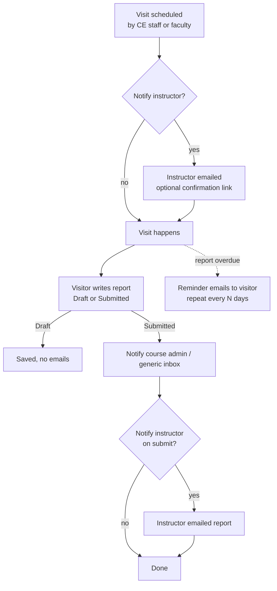

# Class Visit Configuration Workbook

## Canusia CEP Manager — Classroom Visits & Visit Reports

**College / Institution:** ____________________________________

**CE Coordinator:** ____________________________________

**Date Completed:** ____________________________________

**Canusia Implementation Contact:** ____________________________________

---

**How to use this document**

This workbook guides you through the decisions Canusia needs to configure your Class Visit module. The Class Visit module lets your team schedule classroom visits to concurrent-enrollment sections, capture a structured visit report afterward, and keep instructors and course administrators in the loop by email. Work through each section and fill in the response fields. Wherever you see a checkbox, select all that apply. Wherever you see a blank line, write in your answer. Bring this completed document to your kickoff or discovery call.

---

## How a Class Visit Flows

Before answering the questions, it helps to understand the lifecycle you are configuring. Each section below maps to one of these stages.



---

## Section 1 — Who Conducts and Schedules Visits

Class visits are conducted by **visitors** — typically CE administrators or faculty course administrators who observe the classroom and write the report. Visits can be scheduled by your central CE office, by faculty who oversee the course, or both.

**1.1** Who in your program schedules class visits?

- [ ] CE office staff only
- [ ] Faculty / course administrators schedule their own visits
- [ ] Both CE staff and faculty schedule visits
- [ ] Other: ____________________________________

**1.2** Who typically serves as the **visitor** (the person who observes the class and writes the report)?

- [ ] CE administrators
- [ ] Faculty course administrators / liaisons
- [ ] A mix, depending on the course
- [ ] Other: ____________________________________

**1.3** Should instructors (the high school teachers being visited) be able to see their scheduled visits and the finished reports in their own portal?

- [ ] Yes — instructors see their visits and the public portion of each report
- [ ] No — visits and reports stay internal to CE/faculty

---

## Section 2 — Visit Types

Each visit is tagged with a **type** so you can distinguish, for example, a first-time observation from a routine follow-up. You define the list of types that appear in the scheduling form.

**2.1** What types of class visits does your program conduct? (The system default is *Initial*, *Follow-up*, *Annual*.) List the types you want available:

| Visit Type | When it applies |
| :-- | :-- |
| | |
| | |
| | |
| | |

**2.2** Is a visit type **required** every time a visit is scheduled, or optional?

- [ ] Required
- [ ] Optional

---

## Section 3 — Which Sections Are Visitable

When scheduling, the system presents a list of class sections to choose from. You can limit that list by section status so staff don't accidentally schedule against closed or canceled sections.

**3.1** Which sections should appear in the scheduling list?

- [ ] **Active sections only** (the usual choice)
- [ ] **Inactive / closed sections only**
- [ ] **All sections**, regardless of status

**3.2** Some sections never need a visit (for example, fully online sections, exempt courses, or sections delivered in an alternate format). The system lets staff flag a section as **"visit not needed"** so it drops off the unscheduled list. Do you want to use this exemption feature?

- [ ] Yes — we will mark certain sections as not needing a visit
- [ ] No — every section is expected to receive a visit

**3.3 (If yes)** What kinds of sections would you typically mark as not needing a visit?

____________________________________

____________________________________

---

## Section 4 — The Visit Report

After a visit, the visitor completes a **visit report**. The report form is fully configurable: you define each field, its label, its input type, whether it is required, and whether it is **public** (visible to the instructor and included in the report PDF the instructor can download) or **internal** (visible only to CE/faculty).

A report is saved as a **Draft** while in progress and becomes **Submitted** when finalized. Notifications (Section 6) fire only on submission.

**4.1** List the fields you want on the visit report. For each, indicate the input type and whether it is required and public.

> Input types available: **Short text**, **Paragraph (long text)**, **Dropdown (choose one)**, **Checkbox (yes/no)**, **Date**.

| Field Label | Input Type | Required? | Public to instructor? | Dropdown options (if applicable) |
| :-- | :-- | :-: | :-: | :-- |
| *e.g. Overall classroom rating* | *Dropdown* | *Yes* | *Yes* | *Excellent / Satisfactory / Needs improvement* |
| | | | | |
| | | | | |
| | | | | |
| | | | | |
| | | | | |
| | | | | |

**4.1a** Do any fields only apply to certain visit types (Section 2)? Each field can optionally be limited to one or more visit types (e.g. an "Improvement plan" field that only shows on a *Follow-up* visit); fields left unrestricted show on every visit report regardless of type.

| Field Label | Applies to which Visit Type(s)? (blank = all) |
| :-- | :-- |
| | |
| | |

**4.2** Should the visitor record who they spoke with during the visit (instructor, school administrators)? If so, what should be captured?

____________________________________

____________________________________

**4.3** Do visitors need to **attach files** to a report (photos, signed forms, handouts)?

- [ ] Yes
- [ ] No

---

## Section 5 — Instructor Confirmation

Optionally, when a visit is scheduled the instructor can receive a link to **confirm** the visit date — no login required. This is useful when you want the teacher to acknowledge the visit ahead of time.

**5.1** Do you want instructors to confirm scheduled visits via an email link?

- [ ] Yes — include a confirmation link in the "visit scheduled" email
- [ ] No — confirmation is not required

---

## Section 6 — Email Notifications

The module can send emails at three moments in the lifecycle. Each email has a configurable **subject** and **message body**. Message bodies support **shortcodes** — placeholders that the system fills in automatically. The available shortcodes are listed under each email below.

> You do not have to enable every email. Turn on only the ones your program needs.

### 6A — When a visit is scheduled (to the instructor)

**6A.1** Send the instructor an email when a visit is scheduled for their class?

- [ ] Yes
- [ ] No

**6A.2 (If yes)** Subject line:

____________________________________

**6A.3 (If yes)** Message body (use the shortcodes below as needed):

> Available shortcodes: `{{teacher_first_name}}`, `{{teacher_last_name}}`, `{{visit_date}}`, `{{visitors}}`, `{{class_sections}}`, `{{type_of_visit}}`, `{{pre_visit_note}}`, `{{confirmation_link}}`

```
(write your message here)


```

### 6B — When a report is submitted (to the instructor)

**6B.1** Send the instructor an email when the visit report is submitted?

- [ ] Yes
- [ ] No

**6B.2 (If yes)** Subject line:

____________________________________

**6B.3 (If yes)** Message body:

> Available shortcodes: `{{teacher_first_name}}`, `{{teacher_last_name}}`, `{{visit_date}}`, `{{public_report_url}}`

```
(write your message here)


```

### 6C — When a report is submitted (to your office)

Every submitted report also notifies someone on **your** side so the record can be reviewed or filed. This can route to each course's administrator automatically, or to a single shared inbox.

**6C.1** Who should receive the internal "report submitted" notification?

- [ ] The **course administrator** for that course (routed automatically per course)
- [ ] A **single shared inbox** — address: ____________________________________

---

## Section 7 — Overdue Report Reminders

If a visit has happened but the visitor has not yet submitted a report, the system can send the visitor reminder emails on a repeating schedule until the report is in.

**7.1** Do you want automatic reminders for overdue visit reports?

- [ ] Yes
- [ ] No

**7.2 (If yes)** How many days apart should reminders repeat? (Default is 7.)

__________ days

**7.3 (If yes)** Reminder subject line:

____________________________________

**7.4 (If yes)** Reminder message body:

> Available shortcodes: `{{visitor_first_name}}`, `{{visit_date}}`, `{{class_sections}}`, `{{report_url}}`

```
(write your message here)


```

---

## Section 8 — Visit-Based Payments (Optional)

Some programs pay a stipend or honorarium tied to completed visits. The module can mark each submitted report as **payment processed** so your team can track which visits have been paid out. This is a manual flag managed by CE staff — it does not move money on its own.

**8.1** Does your program tie any payment or stipend to completed class visits?

- [ ] No
- [ ] Yes — we will use the payment-processed flag to track payouts
- [ ] Yes, but handled entirely outside this system — describe: ____________________________________

**8.2** Turn on **Payment Tracking** for the module? When Yes, CE staff can mark submitted visit reports as paid from the CE Class Visits page. (Default: No.)

- [ ] No — payment tracking stays off
- [ ] Yes — enable payment tracking

---

## Section 9 — Reporting Needs

The module includes standard exports available to CE staff:

| Report | What it contains |
| :-- | :-- |
| Scheduled Visits Export | All scheduled visits with sections, visitors, and report status |
| Visit Reports Export | Submitted reports, with a column per configured report field |
| Pending Visit Reports Export | Past visits whose reports are missing or unsubmitted |
| Unscheduled Classes Export | Sections with no visit scheduled and not marked "not needed" |

Visitors and instructors can also download visit reports as a combined **PDF** (instructors and faculty see public fields only; CE staff see all fields).

**9.1** Are these standard reports sufficient, or do you need additional reporting?

- [ ] Standard reports are sufficient
- [ ] We need additional reporting — describe: ____________________________________

**9.2** Who needs access to the visit reports and exports, and at what level?

| Role | Access Level |
| :-- | :-- |
| CE Coordinator | All visits |
| Faculty | Their own courses |
| Other: | |

---

## Section 10 — Go-Live & Email Activation

To avoid emails going out before you are ready, the module has a master email switch with three positions:

- **On** — emails send to real recipients.
- **Debug** — all emails redirect to a test address list so you can preview them safely.
- **Off** — no emails are sent at all.

**10.1** Provide the email address(es) Canusia should use for **Debug** testing during setup:

____________________________________

**10.2** Confirm the date you want to switch the module to **On** (live emails):

____________________________________

---

## Section 11 — Open Items & Notes

Use this section to capture anything that doesn't fit the questions above, or items that need follow-up before configuration can begin.

| # | Open Item | Owner | Target Date |
| :-: | :-- | :-- | :-- |
| 1 | | | |
| 2 | | | |
| 3 | | | |
| 4 | | | |

**Additional notes:**

____________________________________

____________________________________

____________________________________

---

*Canusia, Inc. | Class Visit Configuration Workbook | Confidential*
*Version 1.0 | For implementation use only*
