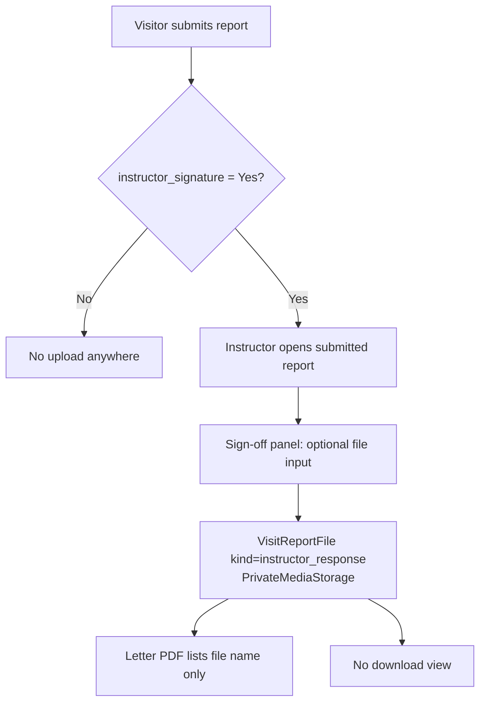

# Visit report attachments

## Overview

How file attachments on a class-visit report work as of `v0.0.18`, written for #16 so
that the client workbook and the client_management settings export describe them
correctly. **Short version:** visitors cannot attach files to a report. Only an
*instructor* can attach a file, as part of their sign-off response, and only when
`instructor_signature = Yes`. The file is stored, and its name is printed on the letter
PDF, but **no page or URL lets anyone download it yet**.

## Current flow

## Answers to the issue's questions

| # | Question | Answer today |
|---|----------|--------------|
| 1 | Can a visitor attach files? From where? | **No.** The faculty report form (`VisitReportDynamicForm`) has no file input and `report_fields_json` has no `file` type. The legacy forms that created `VisitReportFile` were deleted in #9 because no view used them. The `faculty_attachment` kind still exists on the model, but nothing writes it. The only upload is the instructor sign-off panel (`instructor/_report_detail_body.html`, field `response_file`), and only on a **Submitted** report. |
| 2 | Where are files stored? Limits / checks? | `VisitReportFile.file` uses `cis.storage_backend.PrivateMediaStorage` (S3, `private/` prefix, private ACL, no overwrite), under `upload_to='visit_report_files/'`. **No size limit, no type/extension allow-list, no virus scan**: `views/instructor.py::sign_report` saves `request.FILES['response_file']` as given. The host settings don't set `FILE_UPLOAD_MAX_MEMORY_SIZE` or `DATA_UPLOAD_MAX_MEMORY_SIZE`. |
| 3 | Who can see/download them? PDF? | **Nobody, in the UI.** No URL serves a `VisitReportFile`. `VisitReport.visit_files_html` (raw S3 URLs) and `VisitReportFileSerializer` exist but are not used anywhere. The letter PDF (`services/pdf.py::_signoff_context`) lists the **file names** of instructor-response files (CE, faculty and the instructor's public-only PDF all include them). The scoped download view that the #14 plan specified (owner instructor, visitors and CE get 200; others get 404) was never built. |
| 4 | Configurable per tenant? | Only indirectly: the upload input appears only when `instructor_signature = Yes`. There is no separate attachments on/off switch and no "required" option. |
| 5 | `report_fields_json` file type, or a fixed feature? | See the recommendation. |

## Recommendation

1. **Fix the gap first (bug).** Build the #14 download view: a scoped view per portal that
   streams the private file, with access for the owning instructor, the visit's visitors
   and CE, and 404 for everyone else. Then list attachments with links on the CE, faculty and
   instructor report pages. Add a size cap (e.g. 10 MB) and an extension allow-list
   (pdf, docx, jpg, png) to the upload.
2. **Visitor attachments → a `report_fields_json` field type**, `{"type": "file", "name": …,
   "label": …, "required": …, "public": …, "visit_types": […]}`. This reuses everything the
   field engine already does: per-visit-type filtering, required-on-submit while drafts skip
   it (#11), public/private, and help text. A tenant then sets "attach the signed observation
   form" as a field rather than as a separate setting. Files would be stored as
   `VisitReportFile(kind='faculty_attachment')`, with the field name recorded in a new
   column or in `meta`.
3. Until (2) ships, the **workbook should not ask** whether visitors need attachments. It
   should say that photos and handouts can't be attached yet and capture the need as a
   feature request.

## What client_management should say

- Settings export: there is **no** attachment setting to export. `instructor_signature`
  is the only switch that exposes an upload, and that upload is the instructor's.
- Workbook: drop the "attach files" question. If a client asks, record it as a request
  for the `file` report-field type.

## Key Files

| File | Purpose |
|------|---------|
| `class_visit/models.py` (`VisitReportFile`) | Attachment model: `kind`, `uploaded_by`, private S3 storage |
| `class_visit/views/instructor.py` (`sign_report`) | The only code that creates attachments |
| `class_visit/templates/class_visit/instructor/_report_detail_body.html` | Instructor upload input |
| `class_visit/services/pdf.py` (`_signoff_context`) | Prints attachment names on the letter |
| `class_visit/templates/class_visit/letter_body.html` | Letter sign-off block |
| `class_visit/services/report_fields.py` | Field-type engine a `file` type would extend |
