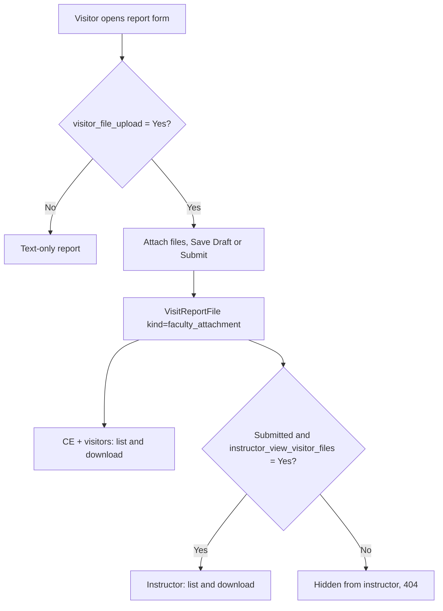

# Visit report attachments

## Overview

How file attachments on a class-visit report work. This doc started as the #16
investigation of `v0.0.18`, when visitors could not attach files and nobody could download
any. It now describes the behaviour that followed from it. Everything is stored in
`VisitReportFile`. Its `kind` field records who attached the file:

| `kind` | Label | Attached by | Where |
|---|---|---|---|
| `faculty_attachment` | Visitor attachment | a visitor (or CE) | the visit report form, when `visitor_file_upload = Yes` |
| `instructor_response` | Instructor response | the instructor | the sign-off panel, when `instructor_signature = Yes` (#14) |

## Flow

## Settings

| Setting | Default | Effect |
|---|---|---|
| `visitor_file_upload` | No | The report form shows a multi-file input. Turning it off later stops new uploads; existing files stay visible and downloadable. |
| `visitor_file_required` | No | With uploads on, **Submit** needs at least one visitor file (already attached or in the same save). Drafts are exempt. Enforced in `VisitReportDynamicForm.clean()`. |
| `instructor_file_required` | No | With sign-off on, a sign-off / response is refused, with nothing written, unless the instructor uploads a file or already has one. Enforced in `views/instructor.py::sign_report`; the panel shows the error via `?signoff_error=file_required`. |
| `instructor_view_visitor_files` | No | The instructor sees and can download visitor files on a **submitted** report. Shown in the settings form only when uploads are Yes. |

## Rules

| Topic | Rule |
|---|---|
| Limits | 10 MB per file. Extensions: pdf, doc, docx, xls, xlsx, ppt, pptx, txt, csv, jpg, jpeg, png, gif, heic. A rejected file fails the whole save, and the error names the file. No virus scanning. |
| Storage | `cis.storage_backend.PrivateMediaStorage` (private S3), under `visit_report_files/`. Downloads are streamed by scoped views; storage URLs are never exposed. |
| CE | Lists and downloads every attachment (`class_visit:ce_download_file`). |
| Visitors | List and download every attachment on their visit's report, including the instructor's response files (`faculty_class_visit:download_file`). Can remove their own kind of file while the report is a Draft (`remove_file`). |
| Instructor | Always gets their own response files. Gets visitor files only under the setting above (`instructor_class_visit:download_file`). Anything else is 404. |
| Letter PDF | Lists instructor-response file names only (PDFs cannot embed files). |

## Possible next steps

- A `report_fields_json` `file` type, if a tenant needs per-visit-type or per-field
  attachments (e.g. "signed observation form" on Initial visits only).
- Visitor file names on the CE/faculty letter PDF.

## Key Files

| File | Purpose |
|------|---------|
| `class_visit/models.py` (`VisitReportFile`) | Attachment model: `kind`, `uploaded_by`, private storage |
| `class_visit/services/uploads.py` | Limits, multi-file field, visibility rules, listing rows, download response |
| `class_visit/forms/faculty.py` (`VisitReportDynamicForm`) | Adds `cv_visitor_files` when enabled; saves visitor files |
| `class_visit/views/{ce,faculty,instructor}.py` (`download_file`, `remove_file`) | Scoped download / remove |
| `class_visit/templates/class_visit/_attachments.html` | Shared attachment list |
| `class_visit/views/instructor.py` (`sign_report`) | Instructor-response uploads |
| `class_visit/settings/class_visit.py` | `visitor_file_upload`, `instructor_view_visitor_files` |
